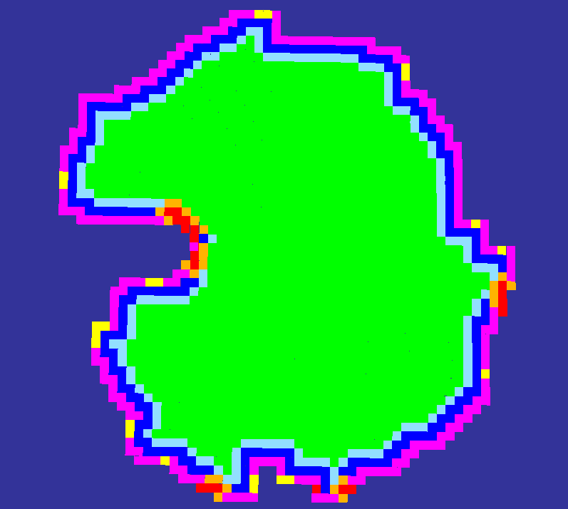

# traversability_generator3d

[](LICENSE)

A C++ library for **3D traversability estimation from Multi-Level Surface (MLS) maps**, developed at the [DFKI Robotics Innovation Center](https://robotik.dfki-bremen.de/en/startpage.html).

The library takes an MLS map as input and produces a `TraversabilityMap3d` enriched with slope, step height, orientation constraints, and soil semantics. This enables safe and robot-specific navigation in unstructured outdoor environments.

## Features

- Input: **Multi-Level Surface (MLS) maps**  
- Plane fitting with **PCL RANSAC**  
- Slope and step height checks using **AABB/OBB** methods with **CGAL**
- Orientation-dependent motion constraints (incline limiting)  
- Robot footprint-aware **obstacle and frontier inflation**  
- **Soil-aware traversability** (sand, gravel, rocks, concrete) with uncertainty propagation  
- ROS/ROS2 compatibility and RViz visualization support  

## Dependencies

- [Eigen3](https://eigen.tuxfamily.org/)  
- [PCL (>=1.7)](https://pointclouds.org/) with segmentation module  
- [CGAL](https://www.cgal.org/) (Core)  
- [Boost.Serialization](https://www.boost.org/)  
- [OpenSceneGraph](http://www.openscenegraph.org/)
- [Rock base-types](https://github.com/rock-core/base-types)  
- [Rock maps](https://github.com/dfki-ric/slam-maps)  
- [vizkit3d_debug_drawings](https://github.com/rock-gui/gui-vizkit3d_debug_drawings.git) (optional, for visualization)  

## Automatic Install of Dependencies & Build
Install dependencies automatically when building traversability_generator3d. Defining `-DINSTALL_DEPS=ON` for cmake, builds and installs the source dependencies automatically. When `-DCMAKE_INSTALL_PREFIX` is used, the dependencies are also installed there. The install script generates an env.sh file in the `CMAKE_INSTALL_PREFIX` folder. It exports all neccessary environment variables.

```
git clone https://github.com/dfki-ric/traversability_generator3d.git -b paper
cd traversability_generator3d
mkdir build && cd build
cmake -DINSTALL_DEPS=ON -DRUN_TESTS=ON -DCMAKE_INSTALL_PREFIX=./install ..
make install
source install/env.sh
```

## Node types

The core output of `traversability_generator3d` is a `TraversabilityMap3d`, where each cell is represented as a node enriched with slope, step height, soil information, etc.  
To support planning and decision-making, nodes are classified into the following categories:

- 🟩 **Traversable**: The robot can stand (with its center) on this patch in at least one orientation without hitting an obstacle.
- 🟥 **Obstacle**: There is no way that the robot can stand (with its center) on this patch.
- 🟦 **Frontier**: Borders to the end of the map. Should be traversable (I am not 100% sure about this. check the code!)
- 🟪 **Unknown**: This is a virtual patch that serves as boundary for algorithms. This patch does not exist in reality. Patches also become unknown if there is not enough support in the MLS to be sure that a patch exists in this location.
- ⬛ **Hole**: This is part of the map specification but is not used by traversability_generator3d.
- 🟨 **Unset**: This is the starting state of a new patch. It should not be visible in a fully explored map. If you see a yellow patch after map expansion is done, you have found a bug in the `TraversabilityMapGenerator` and should investigate.
- 🟧 **Inflated Obstacle**: An obstacle patch expanded to include a safety buffer around the actual obstacle. These are not traversable.
- **Inflated Frontier**: A frontier patch that has been inflated for planning safety margins. Indicates proximity to exploration boundaries.



### Why node types matter

This rich classification scheme provides more than just a binary safe/unsafe map. It enables planners to:  
- Prioritize safe traversal while accounting for soil costs.  
- Use **frontier nodes** to guide exploration and map growth.  
- Maintain safety margins by considering **inflated nodes**.  

Together, these node types form the backbone of the `TraversabilityMap3d`, making it both a **planning tool** and a **research framework** for robust traversability estimation.

## Soil-Aware Traversability

Traversability estimation can optionally incorporate **semantic soil information** that influences traversal costs and feasibility.

Supported soil types:
- **Concrete**
- **Rocks**
- **Sand**
- **Gravel**
- **Unknown / Unlabeled**

Each soil sample is modeled as a **Gaussian distribution** over the map with configurable parameters:
- `sigmaX`, `sigmaY` – spatial influence (spread)
- `uncertainty ∈ [0,1]` – confidence of the soil label

This allows **soft, probabilistic integration** of sparse soil observations into the traversability map.

---

## Interactive GUI

### GUI Controls

Below the visualization window, the GUI provides:

- **Soil type dropdown**
  - `No selection` (default)
  - `CONCRETE`
  - `ROCKS`
  - `SAND`
  - `GRAVEL`
- **σx, σy spin boxes**
  - Control the Gaussian spread of the soil sample
- **Uncertainty spin box**
  - Confidence of the soil label in the range `[0, 1]`

### Interaction Logic

- **Left-click on MLS Map with “No selection”**
  - Sets the **start pose**
  - Triggers traversability expansion

- **Left-click on MLS Map with a soil type selected**
  - Sets the **start pose**
  - Adds a **SoilSample** at the clicked location
  - Triggers traversability expansion
  - Soil influence is applied on the traversability expansion
    
- **Left-Click on button Reset Traversability and Soil Maps**
  - Resets the data structures for traversability and soil map.

This interaction model ensures a **clear separation** between navigation setup and environment annotation.

## Run Example with Test Data  

You can quickly verify the setup by downloading and running the provided test datasets.  

### 1. Download the sample point clouds
```bash
wget https://zenodo.org/records/13771864/files/utah.ply
wget https://zenodo.org/records/13771864/files/test_area.ply
```

### 2. Run the traversability generator
```bash
./build/gui/traversability_generator3d_bin-qt5 utah.ply 0.3
./build/gui/traversability_generator3d_bin-qt5 test_area.ply 0.2
```
> 💡 **Tip:** The following enviroment variables can be used to control the behaviour of the logger: **BASE_LOG_LEVEL** Set to one of DEBUG, INFO, WARN, ERROR or FATAL to define the maximum logging level.

### 3. Inspect the results in the GUI
- After the GUI loads, **left-click on the MLS map**.  
- The corresponding **TraversabilityMap3d** will expand and display navigable vs. non-navigable regions.  

> 💡 **Tip:** The second argument (`0.3` or `0.2`) specifies the resolution in meters, which controls the grid size for the MLS and traversability map.

### 4. Code Example
```bash
./build/test/test_travgen utah.ply
```

## Acknowledgements

This library was developed at the [DFKI Robotics Innovation Center](https://robotik.dfki-bremen.de/en/startpage.html) and funded by the **German Federal Ministry of Education and Research (BMBF)**.  

## License

This project is released under the [BSD-3-Clause License](LICENSE).
