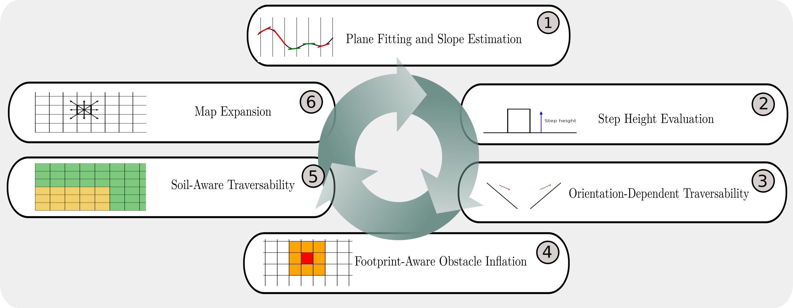

# Summary

`traversability_generator3d` is a C++ library that converts Multi-Level Surface (MLS) [@triebel2006multilevel] maps into 3D traversability maps. Unlike traditional 2D elevation-based maps, MLS preserves multiple surface hypotheses per cell, making it well-suited for environments with rubble, vegetation, bridges, or overlapping terrain layers. The library builds on the MLS representation to provide robot-specific traversability analysis, where each grid cell is enriched with slope, step height, plane fitting results, allowed motion orientations, and optional soil semantics. The result is a `TraversabilityMap3d` suitable for autonomous navigation. It is designed for real-world robotic applications including construction robotics, disaster response, search-and-rescue, and planetary exploration, where terrain is uneven, uncertain, and multi-layered.

`traversability_generator3d` was originally developed as part of ugv_nav4d [@Bockmann_ugv_nav4d] and later separated into a stand-alone library to facilitate independent use and broader applicability.

# Statement of need

Safe and efficient navigation requires robots to distinguish where they can move from where they cannot. This is especially critical for outdoor field robots, walking excavators, and planetary rovers that face slopes, steps, loose soil, or debris. Existing approaches often use 2.5D elevation maps [@fankhauser2018probabilistic] that store only one surface per XY cell, losing critical information when multiple layers overlap, voxel/octree maps [@hornung2013octomap] preserve 3D structure but are memory-intensive and less tailored for traversability, and purely semantic approaches [@cramer2018traversability; @wiesmann2021traversability] that classify terrain appearance but often neglect physical constraints like slope or robot footprint.  

`traversability_generator3d` addresses these limitations by:

- Taking MLS as input, retaining multi-level terrain structure.
- Performing plane fitting and slope analysis per patch, allowing orientation-dependent motion constraints.
- Checking step height and body collisions with robot-specific geometry (AABB/OBB checks).
- Supporting soil-aware traversability, where semantic labels (sand, gravel, rocks, concrete) are integrated with uncertainty.
- Producing a 3D traversability map with rich node types that planners can use directly.  

## Input

The library consumes Multi-Level Surface (MLS) maps, which store multiple surface hypotheses per grid cell. This allows the library to reason about environments with overlapping structures (e.g. bridges, rubble, vegetation), unlike simpler 2.5D elevation maps.

## Processing pipeline

The traversability generation proceeds in several stages:

1. Plane fitting and slope estimation  

   - Local surface patches are extracted from the MLS and fitted with planes using RANSAC (via PCL).
   - Each patch’s slope angle and slope direction are computed from the fitted plane normal.

2. Step height evaluation  

   - Both axis-aligned (AABB) and oriented bounding box (OBB) checks are performed to test whether nearby patches exceed the robot’s configured maximum step height.
   - This ensures that steps or discontinuities larger than the robot’s physical capability are marked as obstacles.

3. Orientation-dependent traversability

   - On steep slopes, the library restricts the allowed orientations of motion (incline limiting).
   - For example, forward uphill/downhill motion may be permitted.

4. Footprint-aware obstacle inflation 

   - Obstacles and frontiers are grown outward by the robot’s footprint radius.
   - This guarantees that planned paths account for the full robot body, not just its center point.

5. Soil-aware traversability

   - In addition to geometry, the library maintains a parallel `TraversabilityMap3d<SoilNode*>` to model soil types.
   - Soil samples (sand, gravel, rocks, concrete) can be injected with associated uncertainty.
   - A Gaussian propagation mechanism distributes soil probabilities spatially, and costs are updated accordingly.
   - Certain soils may be forbidden entirely (e.g., robots not allowed to enter sand), in which case nodes are automatically converted to obstacles.

6. Map expansion

   - The library grows the traversability map outward from user-defined start nodes.
   - Unknown areas are classified as `FRONTIER` nodes, guiding exploration.
   - Expansion can be bounded by distance to restrict computation to a region of interest.

## Output

The result is a `TraversabilityMap3d` structure with two layers:  

- Geometric traversability (`TravGenNode`) containing slope, plane, step height, allowed orientations, cost, and node type.
- Soil traversability (`SoilNode`) containing soil type probabilities and semantic costs.  

# Traversability node types

Each cell in the `TraversabilityMap3d` is represented as a `TravGenNode` with geometric, semantic, and cost attributes.  
Nodes are categorized as:

- `TRAVERSABLE`: safe patches where the robot can move.
- `OBSTACLE`: unsafe regions due to excessive slope, step height, body collisions, or forbidden soil.
- `FRONTIER`: expansion boundaries between known and unknown areas.
- `INFLATED_OBSTACLE`: obstacles grown outward to include robot footprint.
- `INFLATED_FRONTIER`: expanded frontiers with safety margins.
- `UNKNOWN`: regions with insufficient or missing MLS data.
- `HOLE`: gaps where too few patches exist to support safe navigation.
- `UNSET`: unclassified nodes during initialization.

This classification enables downstream planners to reason not only about safe/unsafe areas but also about uncertainty and exploration frontiers.

# Soil-aware traversability

In addition to geometry, `traversability_generator3d` models soil composition. Each `SoilNode` stores probability distributions over soil types. By default, costs are adapted as follows: 

- `Concrete`: low cost (preferred).
- `Sand/Gravel`: higher cost (risky terrain).
- `Rocks`: costly or forbidden depending on configuration.
- `Unknown soil`: assigned maximum cost.

 explores the environment and generates both a multi-level surface (MLS) map and a soil map. Left: MLS converted into a Crex traversability map with smaller obstacle inflation due to the small robot size. Middle: Soil map with sand (yellow), gravel (green), and unknown (light blue). Right: MLS converted into an [Artemis](https://robotik.dfki-bremen.de/de/forschung/robotersysteme/artemis) traversability map fused with soil information, where sand is treated as non-traversable and thus marked as obstacle (red), with larger inflation adjusted for the bigger robot footprint.](figures/soilmap.png)

Through configuration, users can forbid traversal on certain soils, automatically converting affected nodes to obstacles. This enables integration of perceptual information (e.g. from ground-penetrating radar, visual classifiers, or tactile sensors) with geometric terrain reasoning.

# Field Tests

The `traversability_generator3d` library has been used extensively in research projects for almost a decade. It has supported autonomous navigation in several projects, including [Entern](https://robotik.dfki-bremen.de/de/forschung/projekte/entern) [@schwendner2015entern], [ANT](https://robotik.dfki-bremen.de/de/forschung/projekte/ant) [@dettmann2022towards], [VIPE](https://robotik.dfki-bremen.de/de/forschung/projekte/vipe) [@dettmann2018exploration], [KiMMI-SF](https://robotik.dfki-bremen.de/de/forschung/projekte/kimmi-sf), [HiSE](https://robotik.dfki-bremen.de/de/forschung/projekte/hise), [PerSim](https://robotik.dfki-bremen.de/de/forschung/projekte/persim), [CoRob-X](https://robotik.dfki-bremen.de/de/forschung/projekte/corob-x) [@dominguez2025cooperative], [Robdekon2](https://robotik.dfki-bremen.de/de/forschung/projekte/robdekon-ii), and [NoStrandAMust](https://robotik.dfki-bremen.de/de/forschung/projekte/nostrandamust).

As a versatile component for terrain assessment, it has also been applied on a wide range of terrestrial robots at the DFKI Robotics Innovation Center (RIC), such as [Arter](https://robotik.dfki-bremen.de/de/forschung/robotersysteme/arter), [Artemis](https://robotik.dfki-bremen.de/de/forschung/robotersysteme/artemis), [Coyote-III](https://robotik.dfki-bremen.de/de/forschung/robotersysteme/coyote-iii), [Crex](https://robotik.dfki-bremen.de/de/forschung/robotersysteme/crex), [Charlie](https://robotik.dfki-bremen.de/de/forschung/robotersysteme/charlie), [Hunter-SE](https://robotik.dfki-bremen.de/de/forschung/robotersysteme/hunterse), [SherpaTT](https://robotik.dfki-bremen.de/de/forschung/robotersysteme/sherpatt), and [Asguard-IV](https://robotik.dfki-bremen.de/de/forschung/robotersysteme/asguard-iv).

# Acknowledgements

The `traversability_generator3d` library was initiated and is being developed at the Robotics Innovation Center of the German Research Center for Artificial Intelligence (DFKI) in Bremen, in close collaboration with the Robotics Group of the University of Bremen. Its development began within the framework of the Entern project (grant no. 50RA1406) and has since been further advanced in the context of Robdekon2 (grant no. 13N16537) and NoStrandAMust (grant no. 50RA2122). The work has been supported by the German Aerospace Center (DLR) with funding from the German Federal Ministry for Economic Affairs and Climate Action (BMWK) as well as by the German Federal Ministry of Education and Research (BMBF).

We would also like to acknowledge the contributors of the `traversability_generator3d` repository, including the developers visible on the project's GitHub contributors page, for their valuable efforts and dedication. 

# References
